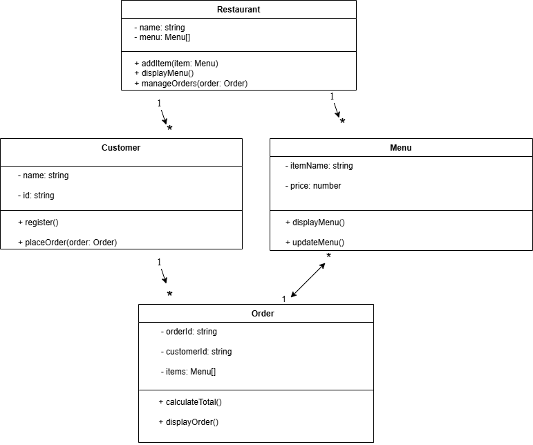

# 🍽️ Restaurant Order Management System

A simple restaurant order management system built with JavaScript. This app allows you to manage menu items, add customers, place orders, and view all orders.

## 🚀 Features
- **Menu Management**: Add and display menu items.
- **Customer Management**: Add customers and track their orders.
- **Order Placement**: Customers can place orders with multiple items.
- **Order Summary**: View all orders with details, including calculated totals.

## 🛠️ Installation

### Clone the repository
Start by cloning the repository to your local machine:

```bash
git clone https://github.com/your-username/Restaurant_Order_Management_System.git
Install dependencies
Navigate into your project directory and install the required dependencies:


cd Restaurant_Order_Management_System
npm install
This will install all necessary packages to run the application.


🏃‍♂️ How to Run the App
To run the app using Nodemon (which will automatically restart the server on file changes), follow these steps:

Start the server with Nodemon:


npm start
The app will run, and you should see output similar to this:

Menu:
- Pizza: $12.99
- Pasta: $8.99
- Burger: $9.99
Orders and customer details will also be logged in the console as they are created.

📁 File Structure
/Restaurant_Order_Management_System ├── /src │ ├── Menu.js # Menu class for adding/displaying items │ ├── Order.js # Order class for creating and calculating orders │ ├── Customer.js # Customer class for managing customer details │ ├── Restaurant.js # Restaurant class for managing restaurant operations │ └── index.js # Main entry point to run the app ├── package.json # Project dependencies and scripts └── README.md # Project documentation

File Descriptions:
Menu.js: Manages menu items (add and display).
Order.js: Handles order creation and calculates totals.
Customer.js: Manages customer information and order placements.
Restaurant.js: Main logic to tie everything together (menu, customers, and orders).
index.js: Main entry file where the app is executed.

⚙️ Technologies Used
JavaScript (Node.js): The core programming language.
Nodemon: Tool for automatically restarting the server when files change during development.
🧑‍💻 Contributing
If you'd like to contribute to the project, feel free to:

Fork the repository.
Create a new branch (git checkout -b feature-xyz).
Make your changes.
Commit your changes (git commit -m 'Add feature xyz').
Push to the branch (git push origin feature-xyz).
Open a pull request.
📝 License
This project is licensed under the MIT License.

📧 Contact
For any issues or inquiries, you can contact me at onuprinceley@gmail.com.


🖥️ UML Class Diagram Description
Below is the description of UML Class Diagram representing the system design for the Restaurant Order Management System: The uml diagram is located in the assets folder.




Explanation of the UML Diagram:

Restaurant Class:

Attributes:
name: Name of the restaurant.
menu: A list of menu items available in the restaurant.
orders: A list of orders placed in the restaurant.
Methods:
addCustomer(): Adds a customer to the restaurant.
placeOrder(): Places an order for a customer.
displayOrders(): Displays all orders in the restaurant.

Menu Class:

Attributes:
items: A list of items available in the restaurant's menu.
Methods:
addItem(): Adds a menu item.
displayMenu(): Displays all menu items.

Order Class:

Attributes:
orderId: A unique identifier for each order.
items: A list of items in the order.
total: The total cost of the order.
Methods:
calculateTotal(): Calculates the total cost of the order.
displayOrder(): Displays the order details.

Customer Class:

Attributes:
customerId: A unique identifier for each customer.
name: Name of the customer.
Methods:
placeOrder(): Places an order for the customer.
register(): Registers a new customer.


Below is an example of how the app runs when a customer places an order:


Menu:
- Pizza: $12.99
- Pasta: $8.99
- Burger: $9.99

Princeley Onu placed an order with ID: ORD1

Orders for My Fancy Restaurant:
Order ID: ORD1
Customer ID: C001
Items:
- Pizza: $12.99
- Burger: $9.99
Total: $22.98
This shows the output of placing an order for a pizza and burger for a customer.


